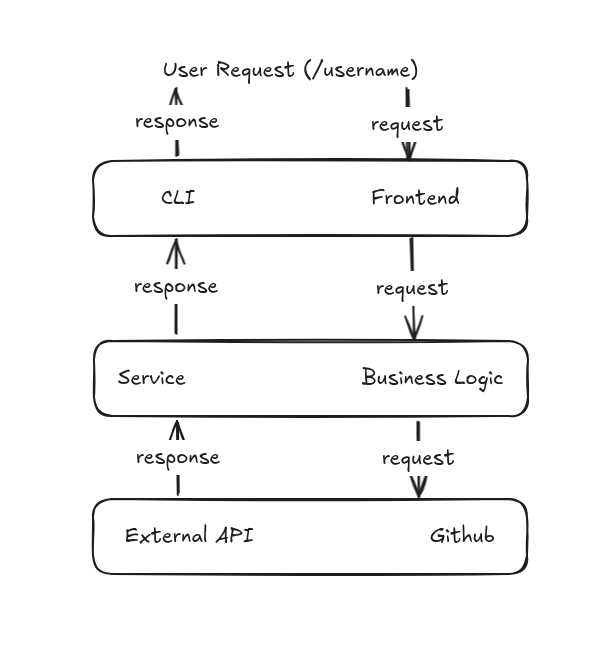
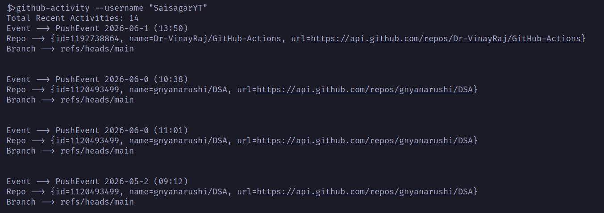

# GITHUB USER ACTIVITY
> In this project I have built a simple command line interface (CLI) that fetches recent activity of GitHub user on terminal. Also, I cover, 
> * Programming skills
> * Working with API
> * Handling JSON data
> * CLI Interface

## Working of Project

## Command
github-activity --username "username"

### Sample output

Reference: https://roadmap.sh/projects/github-user-activity
 
<b>Connect with Me </b>
 
Linkedin → https://www.linkedin.com/in/sai-sagar-a1a96a256/